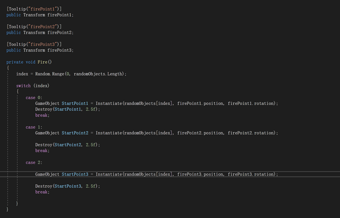

### **Root - A Virtual Environment Game Project**

Team Members: Yuan Yuan, Yan Wang, Ying Tao, JiaYi Leng, Xintian Yin (First version without hardware)
GitHub Link: https://github.com/YingTao-22019022/Final-Project-Creative-Making-Advanced-Visualisation-and-Computational-Environments-main

Demo Video: https://youtu.be/6CSTUefAnUI

#### **Introduction**

This report presents the development and implementation of "Root", a virtual environment game where the player acts as a system administrator on a mission to eliminate viruses and bugs from a computer system. The game was developed using Unity for the 3D environment, Arduino for hardware control, and Blender, Nomad, C4D for the creation of game assets.

The goal of our project was to create an interactive and engaging game environment where players could navigate through different folders in a computer system, represented by the rooms in the game, to locate and destroy viruses, represented by monsters in the game. The player's objective is to find the super virus (boss) that threatens to crash the system and destroy it. The game incorporates a variety of skills and challenges to keep the player engaged and entertained.

Start screen of Root

#### **Design and Implementation**

The game was designed with a user-centered approach, considering an intuitive interface and controls for the player. The 3D game environment and assets were created using Unity, Blender, Nomad, and C4D, with Arduino managing hardware control. 

We began by considering the potential users of our game. We imagined they would be individuals who enjoy both gaming and tech-related themes. Therefore, our game design needed to cater to these interests. This meant creating a narrative that would resonate with this audience, such as the idea of being a "super administrator" tasked with eliminating viruses from a computer system. To provide a more immersive experience, we decided to incorporate Arduino hardware controls.

 

Game scene

Our game environment consists of various 'rooms' represented by system folders, which the player can navigate. Each room can contain viruses (monsters), batteries (HP boosters), or skills.

Room in game

Using Blender, Nomad and C4D, we designed our monsters to visually represent different types of bugs or viruses. The boss monster, the "super virus", was designed to be particularly challenging.

Monsters in two versions of the game

The player can control the game character using four buttons (for movement in four directions), a joystick (for camera rotation), and a sound sensor (for the "F" key attack). Additionally, skills can be triggered using four ultrasonic sensors.

The game features five unique skills: Battery, JavaScript, Java, C#, and Python. These skills, represented as programming languages, can be used to kill monsters or weaken the boss.

Skills

In the context of your virtual game, sensors are used to bridge the gap between the physical world and the digital game environment. They allow players to interact with the game in a more tangible and immersive way. The hardware part we chose ultrasonic sensors, sound sensor, joystick and direction control keys.

There are several reasons for us to choose ultrasonic sensors. First, it is environmentally robust, which perform well under various environmental conditions. It is not affected by dust, dirt, or high ambient light levels, which makes them a reliable choice for a public gaming installation. Second, it do not require physical contact with the target object to detect its presence. Therefore, it makes it easier for players to control the release of skills by using blocks. Third, it is insensitive to color and transparency. Unlike optical sensors, ultrasonic sensors are not affected by the color or transparency of the objects they detect. This ensures consistent performance regardless of the player's appearance or clothing. We also considered infrared sensors. 

However, compared to ultrasonic sensor, it can be affected by ambient light conditions and might not perform reliably in a brightly lit room or in direct sunlight. 

Ultrasonic sensor

As for sound sensor, it can add interactivity to this game. It can create a unique and immersive gaming experience by allowing players to interact with the game using their voices. Second, it is sensitive, which can be adjusted to detect different volume levels, allowing for different levels of interaction based on the loudness of the sound. Third, it doesn’t require physical contact, making it easier for players to operate. 

Sound sensor

Regarding buttons and joystick, they are familiar to players through game consoles or arcade machines. This can make the game more accessible and reduce the learning curve. Buttons provide tactile feedback when pressed, which can be satisfying for the player and provide confirmation that an input has been registered. This can be especially useful in fast-paced games where precise timing is important. Joystick offer precise control over character movement or aiming. It can detect a wide range of motion and direction, making it superior to keys for tasks requiring more than simple binary input. Compared to motion sensors or gesture control devices like the Kinect, which can offer a unique and immersive way to interact with the game, joystick and buttons can be easier to set up, require less space, and offer higher level of precision.

All the hardware used in the game

#### **Responsibilities of each team member**

Yan Wang is a player scene manager and hardware integration developer in our team. She was responsible for coding the player scene manager, data save code, and player movement code in Unity. Besides, She took part in debugging all code issues, ensuring the game runs smoothly without crashes or bugs. Moreover, she managed the integration of the joystick control, writing and debugging the Arduino code for the joystick. Also, she participated in making and decorating game props, including coloring blocks and foam boards, helping to bring the game environment to life.

Yuan Yuan is a visual effects (VFX) and audio specialist, skills developer, and hardware integration developer in our team. She developed and coded the skills and ordinary attacks for the player, monsters, and boss in Unity. Furthermore, she managed the VFX and audio effects in the game, enhancing the overall game aesthetics and audiovisual experience. In addition, she also participated in debugging all code issues, ensuring the smooth operation of the game. What’s more, she handled the ultrasonic sensor code for Arduino, linking and welding jumpers, and integrated the Arduino code into the game. Besides, she participated in making and decorating game props, including coloring blocks and foam boards, contributing to the overall aesthetic of the game environment. She was also responsible for writing the report.

Ying Tao is a User Interface (UI) designer and developer, and hardware integration developer in our team. She designed the UI for the game, ensuring it was intuitive and user-friendly. She also coded the UI in Unity, integrating it with the game's other components. Additionally, she participated in debugging all code issues, ensuring the game's UI functioned flawlessly. Moreover, she managed the sound sensor code for Arduino, linking and welding jumpers, and integrated the Arduino code into the game. What’s more, she participated in making and decorating game props, including coloring blocks and foam boards to create a more immersive gaming environment. 

JiaYi Leng is a monster model modifier, gameplay designer, and media specialist in our team. She utilized C4D to modify and refine the initial monster and boss models to align with the second edition gameplay design. Also, she joined in the design of the second edition gameplay, focusing on enhancing player engagement and game complexity. Besides, she participated in the design and layout of the installation site, ensuring a conducive and immersive environment for players. At last, she handled video editing and clipping for promotional and documentation purposes.

XintianYin is a monster and boss designer and modeler (Digital Version) in our team. She was responsible for the conceptual design and modeling of the monsters and boss in the initial digital version of the game. In addition, she utilized Blender and Nomad to create the 3D models of the monsters and boss, and integrated these models into Unity. Then, she collaborated closely with other team members to ensure that the monster and boss designs fit seamlessly into the overall game environment.

By clearly defining the roles and responsibilities, each team member was able to contribute their unique skills and expertise to the project. This ensured efficient and effective collaboration, leading to the successful completion of the game.

 

#### **Development Process**

The development process of our game was a journey filled with challenges, learning, and innovation. It involved a range of tasks from conceptualizing the game idea, designing and modeling the characters, creating the gameplay mechanics, to integrating hardware components for an immersive experience. Each step required careful planning, creative thinking, and a collaborative effort from our team. We'll delve into each of these steps in detail in the following sections.

At the start of game development, we began with the design of game art. It is primarily divided into two parts: the scene and the character models. Using art resources, we built scenes of a building corridor and various rooms in Unity. We created monster and boss models using Nomad.

Game external Scene

Then, we optimized Unity rendering pipeline. Unity's rendering pipeline is divided into three types: Default, URP (Universal Render Pipeline), and HDRP (High Definition Render Pipeline). We aimed for a better visual effect for the game but had to consider memory usage. Therefore, we opted for the URP pipeline. Since some of the materials we used were for the default pipeline, we needed to upgrade all the resource materials in the project. However, during this process, we encountered problems with resource corruption. It's essential to remember that pipeline upgrades in Unity are irreversible, so always back up your project before upgrading.

Information of URP in Unity official manual

Next comes the part of the game programming. We encountered many challenges in this process, including AI enemies, scene transition management, UI, VFX, and attack commands.

As for AI enemies, three features were added to all enemies in the game, patrolling within a specific range by default, automatically detecting and attacking the player character, and tracking the player character. First, The entire scene was baked using Unity's AI—Navigation—Baking feature. This step helped avoid model penetration, making obstacles impassable.The enemy was then fitted with a Nav Mesh Agent component. Lastly, two empty objects, ‘startPoint’ and ‘endPoint’, were created to guide the enemy to patrol back and forth.

The initial development stage used an ‘if’ statement to determine whether the player was close and started attacking automatically when the player was close. However, this led to some issues which were fixed by dividing the enemy's state into three modes: patrol mode forward, patrol mode backward, and attack mode. The enemy's control code was optimized using a ‘switch()’ statement.

Code for AI enemies

Regarding scene transition management, five room scenes were created, and transitions between different scenes were achieved through portals. The approach avoided stuttering caused by putting a large number of art resources into a single scene. Besides, each room entered from the corridor was random.

Code for scene transition management

Random room transition was realized by automatic script component mounting. Data.cs only calls ‘registerRooms()’ when the game starts running, storing the type of each randomly generated room in an array. Then this function randomly attaches different types of room loading codes to each portal.

Beside random room transition, game data storage after scene refresh is another challenge. Once scene transition functionality was implemented, it was discovered that the game data was refreshed after a scene transition, making it impossible to keep track of the current blood volume and number of items. After some research, a solution was found. We can create an empty object data that doesn't disappear with scene switching and store all the game data that needs to be recorded in it.

Code for data storage

At the same time, we also used Data.cs to store the player's position before entering the room. This resolved the issue of the player returning to the starting point every time they returned to the corridor, ensuring the continuity of the game. Before loading the new scene, we called ‘PlayerPosReset.Instance.SaveData()’ to save the current position.

Code for player position storage

Next are the issues encountered in UI development. Our game primarily used Unity UGUI for user interface development. UGUI helped us to quickly build a variety of 2D user interfaces. However, considering the game interface needed to be adaptable to electronic devices of different screen resolutions and sizes, GUI adaptation was always a relatively tricky issue. To resolve the screen adaptation issue of the GUI, we mainly used the Canvas Scaler component in UGUI. We primarily used Scale With Screen Size, Anchors, Constant Physical Size to adapt to screens of different resolutions, different screen ratios, and different pixel densities. These modes could fix the relative position of UI elements from the screen edge or the screen center, and also scale or fix the size according to the actual screen resolution. We were able to adjust the method used based on the specific needs of a UI element, ultimately ensuring that the game screen could be displayed completely and clearly when switching between different screens.

 

GUI

Beside this, we encountered challenges in VFX and in the setting up of the player's and game NPC's attacks. 

One of the key challenges was to ensure that the player could only fire one bullet at a time, without affecting the character's movement. To solve this, we implemented a cool down mechanism using the ‘isPressed’ flag and ‘cdTime’ variable, which ensured that the player could only fire a bullet if the previous bullet had finished its lifetime. We also used a ‘switch’ statement to handle different key inputs for different skills or actions.

Code for player’s cool down

Second, when the player used a skill, the game called 'bullet prefab' to create instantiated bullets, and also reduces the display of the UI skill count, which is a challenge. Because using 'if' statements would lead to redundant and blocking code, we chose to use 'switch' statements.

Code for player skills

Third, we encountered a problem with the fire point's position. Fire point is the point from where the bullets are instantiated and fired. We had to position it precisely so that the bullets appeared to be coming from the character's gun. To resolve this issue, we used the ‘firePoint’ variables to define the exact point of bullet instantiation.

Code for firepoint

Finally, the positioning and sizing of the colliders were a challenge as well. Beside player and monsters’ skills, the boss had three different skills.One skill is a meteor falling from the sky, one skill is a large area-of-effect ability, and another is a beam. The collider for each one needs to be set accurately. We had to ensure that they were properly placed and sized so that the attack triggers were reasonable and realistic. We used Unity's collider components for this and adjusted their sizes and positions in the Unity editor until we achieved the desired results.

Colliders for boss skills

Since we incorporated hardware, our digital version of the game also underwent iteration. In the second version, we optimized the player's viewpoint and movement control methods. In the initial version, we used a third-person perspective, with the up and down keys controlling forward and backward movement, and the left and right keys controlling turning. However, after testing, we found that the players' left and right movements were not sensitive enough, and since our scenes were relatively small, the third-person perspective obstructed the players' view. Therefore, we decided to change the third-person perspective to a first-person perspective to enhance the game's immersion. To address this problem, we included a joystick to control character movement. The joystick can independently control the viewing angle without conflicting with the up, down, left, and right keys. After this modification, players' forward, backward, left, and right movement controls and left and right turning could be simultaneously controlled. 

 

Joystick shield

At the same time, the release methods for normal attacks and special skills were changed from traditional keyboard keys to voice control and distance sensing respectively. We used corresponding hardware to control the buttons on the keyboard. To increase interactivity, the release of special skills was not purely controlled by the player's hand, but through the throwing of building blocks. Ultrasonic sensors would detect the distance between the blocks and the sensor, and once a certain distance was reached, the skill would be activated.

Code for sensors and joystick to get keyboard keys

Furthermore, we improved the Boss battle segment. In the original version, players used four collected skill items to attack, but the difference between the four skills was only reflected in the changes to the boss's four health bars, which lacked gameplay interest and had a poor interactive experience. Therefore, we improved the Boss's model and corresponded each skill attack target to four parts of the boss (left hand, right hand, shield, and the weapon on the back). When one of the health bars reached zero, the corresponding part of the boss's body would also fall off, providing more feedback to the user.

 

Original boss (left) and boss of second version (right)

#### **Refection and future work**

Firstly, our code was not concise enough; we often used ‘if’ or ‘switch’ statements, which not only caused many codes to keep updating, but also led to redundant codes, causing game stuttering. These could actually be replaced with ‘Dictionary’ to simplify the code. Moving forward, we plan to enhance our coding skills to optimize the game.

**

Code optimization example from ChatGPT

Secondly, we are facing issues with GUI and interaction. In terms of user experience, the current game interaction process only has basic and necessary content, but there are still many deficiencies from the player's game experience. The next step in our optimization is to establish a more complete game tutorial experience. This primarily includes tutorial guides for the core gameplay, the use of hardware, an introduction to different skills in the game, and beginner's tips for passing levels.

In terms of accessibility, we could focus on the different needs of different user groups or special groups, such as visually impaired people, color-blind people, etc., designing a user interface that more user groups could easily use.

As for animations and transition effects, we may focus on adding game opening animations, victory animations, ending animations, and other important game node animation effects to achieve a comprehensive and immersive game experience for players.
